# Muddy - Proving Grounds Box

## Recon

I ran `nmap -sS -sV $TARGET`.

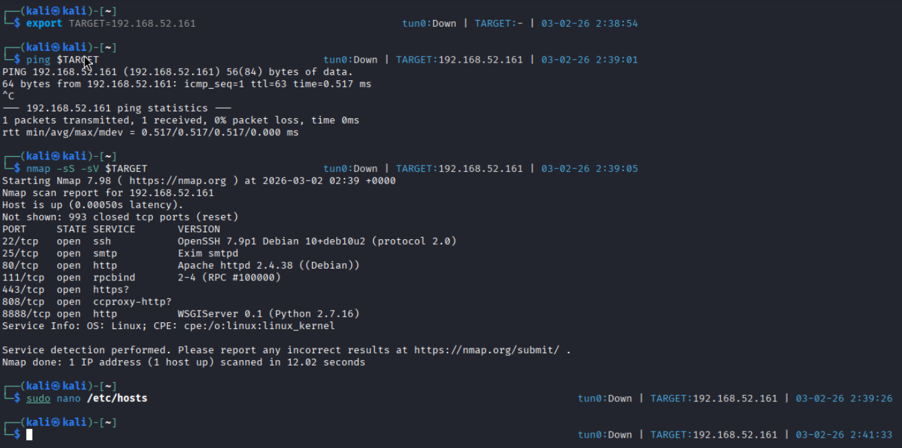

I added the IP to /etc/hosts for the host `muddy.ugc`. I notice a "Ladon" server is hosted on port 8888.

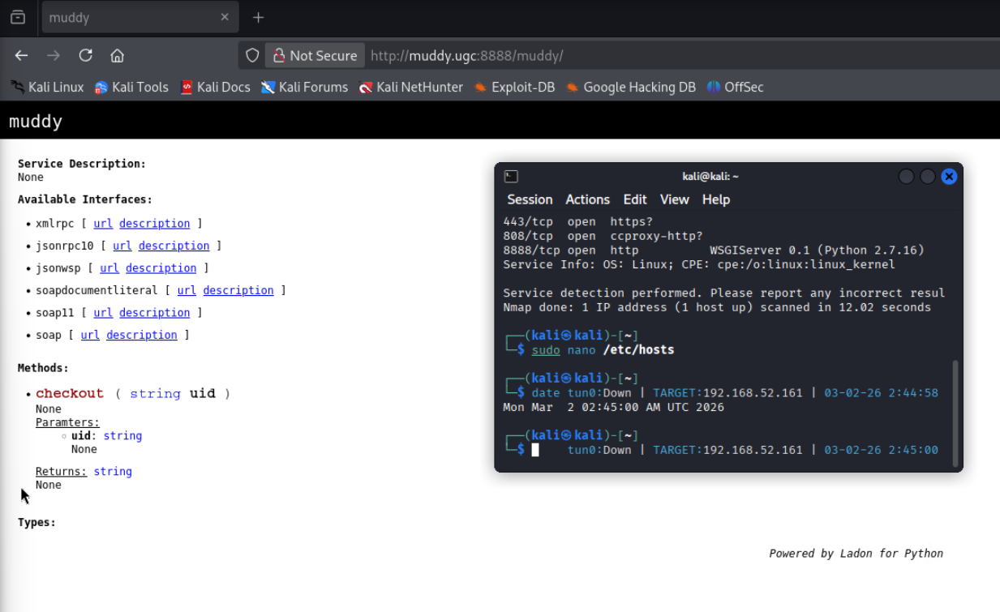

There are some endpoints accepting POST: `xmlrpc`, `jsonrpc10`, `jsonwsp`, etc. Let me do some research on it. Looks like we need to pop an XXE vulnerability.

I also noticed that `gobuster` shows me that WebDAV is enabled. I will likely need to login later with stolen credentials.

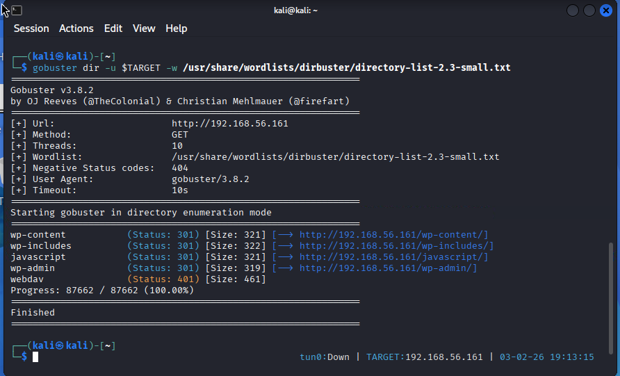

I searched `exploit-db.com` for Ladon XXE vulnerabilities. Apparently all we need for LFI is a `curl` command with the right payload.

## Exploit

### XML XXE Local File Inclusion
I was able to trigger XML LFI with an HTTP POST:

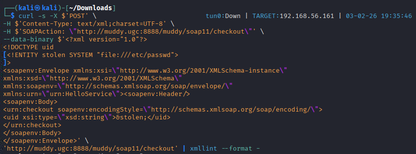

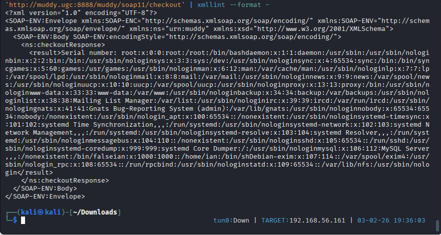

The next step is to use this to steal WebDAV credentials so we can upload a webshell.

I then obtained the `passwd.dav` file by targeting `/var/www/html/webdav/passwd.dav`:

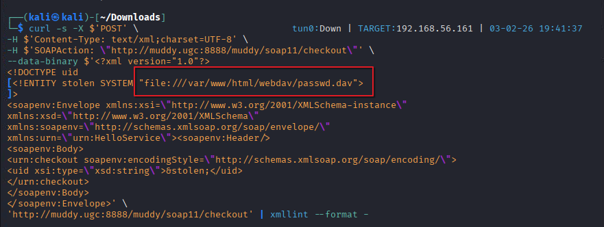

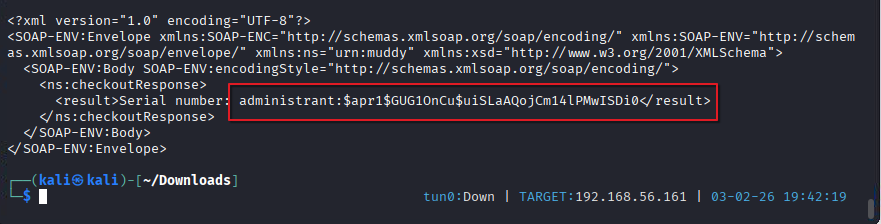
### Cracking WebDAV Credentials

I first need to crack the hashed password for the user `administrant`.

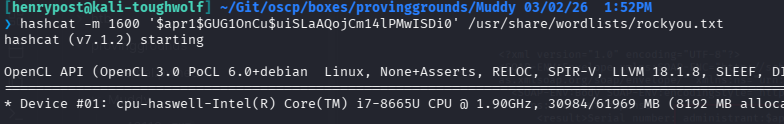

Shortly after that, we get `sleepless` as the password:

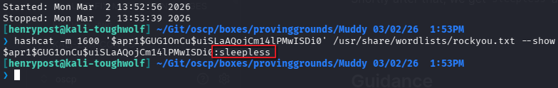

The cred is `administrant:sleepless`.

### Using WebDAV Credentials and uploading a PHP web shell

I prepared a PHP web shell to upload, and started a `nc` listener.

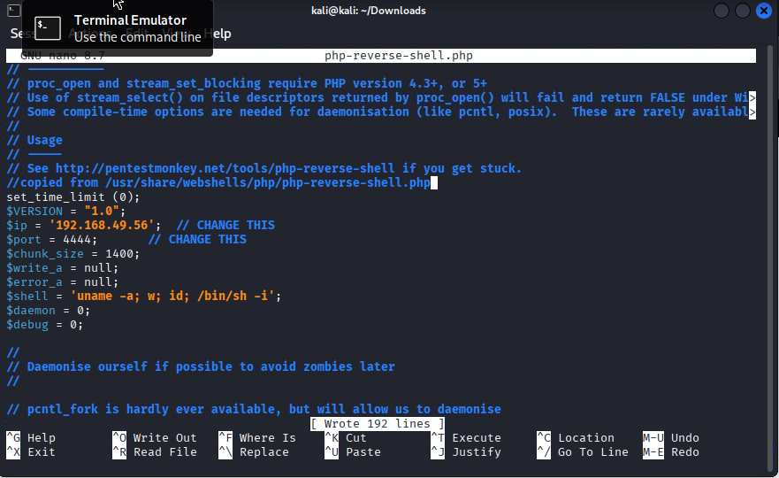

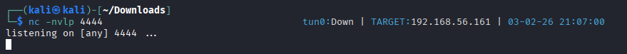

I then uploaded the reverse shell payload:

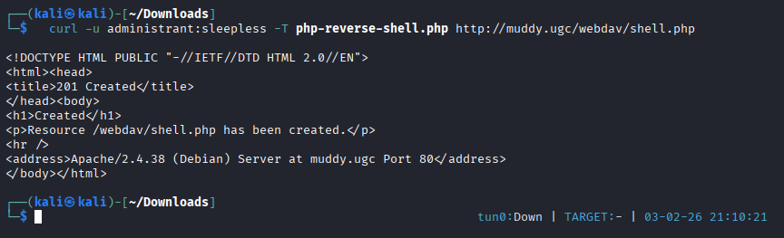

And then I caused the victim PHP runtime to execute our code:

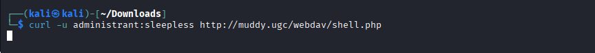

Resulting in a functioning reverse shell running in the php user context, `www-data`:

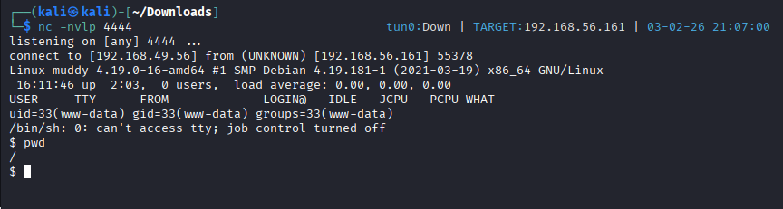

I stabilized my shell with `python3`:

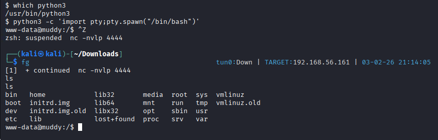

### Pivoting: Cron Job Exploitation

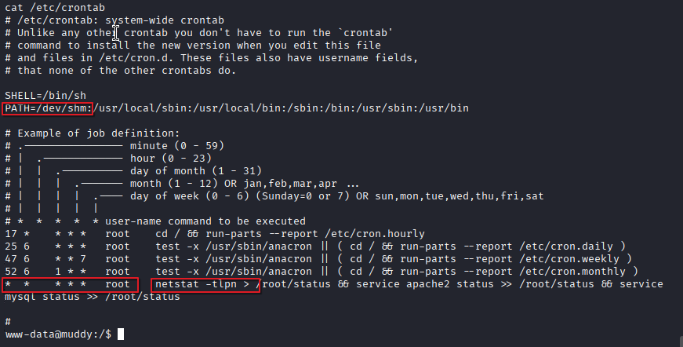

`/dev/shm` is writeable by us.

Because the command `netstat` gets run every 1 minute by `root` user, we can use this to get a root shell on our victim.

We just need to create an executable named `netstat` within the `/dev/shm` folder to achieve root access.

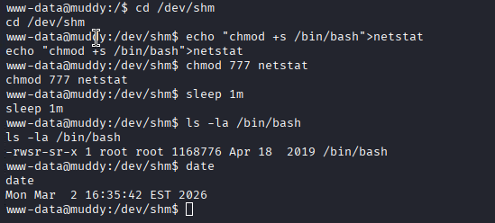

The `s` bit is set on the file `/bin/bash`, meaning we can use `/bin/bash -p` to get a root shell. `p` means "Preserve effective UID", which is `root` in this case.

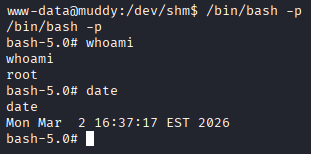

And, we have root access and flag.

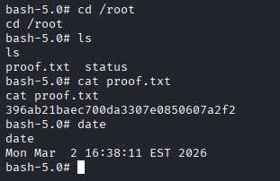

## Guidance

Do not parse XML External Entities.

Do not expose unnecessary XML parsing services over the network.

Consider disabling WebDAV and SOAP XML APIs unless necessary, or putting them behind a firewall.